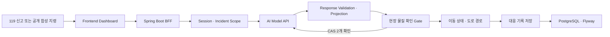

# 케미체크119 Backend

### 화학사고 현장대응 대시보드와 AI 에이전트를 연결하는 Spring Boot BFF

> 불완전한 화학사고 신고와 현장 확인 정보를 AI Model API에 안전하게 전달하고,
> 분석·확인·이동·대응 기록을 하나의 사고 흐름으로 관리하는 백엔드입니다.

- 참가 부문: [제6회 소방안전 빅데이터 활용 및 아이디어 경진대회](https://www.bigdata-119.kr/) · 서비스 개발 부문
- Backend Stack: Java 17 · Spring Boot 3.3 · Spring Security · Spring JDBC · PostgreSQL · Flyway
- Infrastructure: Docker · GitHub Actions · GCP Cloud Run · Cloud SQL · Secret Manager
- Related: [Frontend](https://github.com/chemicheck119-lab/front) · [Analysis Engine](https://github.com/chemicheck119-lab/analysis-engine) · [Speech Service](https://github.com/chemicheck119-lab/speech-service)

## 무엇을 해결하는가

소방대원은 출동 중 신고 내용, 사고물질 후보, 시설의 과거 취급물질, 물질 간 반응성,
현장 위치와 대응 기록을 짧은 시간 안에 함께 확인해야 합니다.

케미체크119 Backend는 프론트엔드와 AI Model API 사이에서 다음 책임을 담당합니다.

| 현장·서비스 문제 | Backend의 해결 방식 |
|---|---|
| AI 응답을 화면에서 그대로 신뢰하기 어려움 | Model API 응답의 schema와 사고 ID를 검증한 뒤 화면 DTO로 변환 |
| 확인되지 않은 물질 조합으로 위험 판정할 수 있음 | 사고물질과 시설물질의 현장 확인을 분리하고 두 CAS가 확인된 경우에만 재분석 |
| 사용자마다 접근할 수 있는 사고가 다름 | 서명 세션의 역할·소속·incident scope를 모든 BFF 경로에서 검사 |
| AI 분석과 현장 확인·이동·기록이 분리됨 | 사고 ID를 기준으로 분석 snapshot, 확인 revision, 이동 상태와 최종 기록을 연결 |
| 외부 AI·지도 Provider 장애 시 잘못된 결과가 표시될 수 있음 | 제한 시간·계약 검증·fail-closed 상태를 적용하고 임의 결과를 생성하지 않음 |
| 배포 버전과 장애 지점을 추적하기 어려움 | request ID, 구조화 로그, health indicator와 release commit을 연결 |

## 전체 흐름



대표 처리 순서는 다음과 같습니다.

```text
신고 수신·사고 선택
→ 서명 세션과 사고 접근 범위 확인
→ 신고·현장 정보를 AI 요청 계약으로 변환
→ Model API 분석 결과 검증
→ 화면용 BFF 응답으로 투영
→ 사고물질·시설물질 현장 확인
→ 확인된 CAS를 포함해 재분석
→ 이동 경로·ETA 확인
→ 분석·확인·이동 상태를 대응 기록으로 저장
```

## 핵심 구현

### 1. FE–BE–AI BFF 계약

프론트엔드는 AI 서버를 직접 호출하지 않습니다. Backend가 인증과 사고 접근 범위를 확인하고,
FE 요청을 Model API 계약으로 변환한 뒤 검증된 결과만 화면 DTO로 반환합니다.

- `X-API-Key`와 `X-Request-Id`를 포함한 서버 간 호출
- 연결 제한 시간과 응답 제한 시간 분리
- 연결 실패와 제한된 `503`만 최대 1회 재시도
- timeout·schema 불일치·인증 실패를 명시적인 BFF 오류로 변환
- Model API Key와 요청·응답 원문을 일반 로그에 기록하지 않음
- OpenAPI·fixture checksum으로 FE–BE–AI 계약 drift 검증

### 2. 현장 확인 Gate

AI가 추정한 물질을 자동 확정하지 않습니다. 사고물질과 시설물질을 서로 다른 역할로 확인하고,
두 CAS가 확인된 경우에만 충돌 규칙이 포함된 재분석을 진행합니다.

- CAS 형식과 check digit 검증
- 인증 사용자·소속·서버 시각·request ID 기록
- 동일 요청은 기존 결과를 반환하는 멱등 처리
- 정정 시 기존 확인을 덮어쓰지 않고 append-only revision 추가
- 과거 confirmation을 보존하고 현재 활성 revision만 다음 분석에 주입
- analysis snapshot을 당시 활성 confirmation ID와 결합해 정정 전 결과 재사용 차단

### 3. 세션·사고 접근 제어

브라우저 세션은 HttpOnly cookie에 담긴 서명 JWT로 검증합니다. Model API Key와 session signing
secret은 프론트엔드에 전달하지 않습니다.

- `RESPONDER`·`COMMANDER`·`ADMIN` 역할
- 사용자·소속·소방서·접근 가능한 incident scope 검증
- 인증 누락·서명 변조·만료는 `401 AUTH_REQUIRED`
- 사고 접근 권한 부족은 `403 ACCESS_DENIED`
- credential CORS allowlist와 wildcard origin 차단
- 운영 Secret은 GCP Secret Manager에서만 주입

### 4. 사고 상태와 대응 기록

운영 저장소는 PostgreSQL을 사용하고 Flyway로 schema 변경을 관리합니다. Spring JDBC transaction과
DB constraint로 사고별 상태와 대응 기록의 일관성을 보존합니다.

- AI agent memory와 analysis snapshot
- 현장 확인 revision과 활성 confirmation
- 이동 context와 최신 movement 상태
- 대화·분석·확인·이동 정보를 결합한 최종 response record
- fingerprint unique constraint 기반 중복 저장 방지
- FE가 다시 전송한 AI JSON이 아니라 서버에 저장된 snapshot을 권위 데이터로 사용

### 5. 이동 경로와 ETA

GPS 갱신은 AI 분석과 분리해 처리합니다. 잘못되거나 오래된 위치에서 임의의 직선 경로와 ETA를
생성하지 않습니다.

- 위도·경도·정확도·관측 시각·journey state 검증
- 사고별 `clientSequence` 단조 증가와 중복·역행 요청 차단
- Naver Directions 5 기반 실제 도로 경로 adapter
- 오래된 GPS, Provider 미구성·장애, 경로 불일치 시 fail-closed 응답
- 검증된 확산 모델이 없으므로 임의의 위험 반경을 계산하지 않음

### 6. 요청 추적과 관측성

FE 요청부터 Model API 호출까지 같은 request ID를 사용합니다. 로그와 metric에는 원문 신고,
물질 검색어, GPS, Cookie, API Key와 같은 민감정보를 넣지 않습니다.

- BFF·Model API 단계별 실행 시간과 결과 기록
- low-cardinality route·operation·outcome만 metric tag로 사용
- liveness·readiness에서 AI, 보안 설정과 DB 준비 상태 분리
- `/actuator/info`에서 배포 commit과 환경 확인

## 주요 API

| Method | Endpoint | 역할 |
|---|---|---|
| `GET` | `/api/c2guard/v1/session` | 인증 사용자·소방서·역할·사고 scope 조회 |
| `POST` | `/api/c2guard/v1/logout` | 서명 세션 만료 |
| `POST` | `/api/c2guard/v1/incidents/analyze` | 신고·현장 context를 AI Model API에 전달하고 화면 응답 생성 |
| `POST` | `/api/c2guard/v1/substances/discover` | 관찰 특징·물질명 기반 후보 검색 |
| `POST` | `/api/c2guard/v1/incidents/{incidentId}/confirmations` | 사고·시설물질 현장 확인과 revision 저장 |
| `POST` | `/api/c2guard/v1/incidents/{incidentId}/movement` | GPS 검증과 도로 경로·ETA 조회 |
| `POST` | `/api/c2guard/v1/incidents/{incidentId}/record` | 분석·확인·이동 정보를 결합한 대응 기록 저장 |
| `GET` | `/api/c2guard/v1/intake/replay-stream/{scenarioId}` | 공개 합성 지령 SSE 시연 |

전체 계약은 [`contracts/dashboard-bff-v1.openapi.json`](contracts/dashboard-bff-v1.openapi.json)을
기준으로 합니다.

## 빠른 시작

### 요구사항

- Java 17
- 실행 가능한 AI Model API
- 운영·staging: PostgreSQL과 필수 Secret

### 실행

```bash
git clone https://github.com/chemicheck119-lab/back.git
cd back

SPRING_PROFILES_ACTIVE=dev ./gradlew bootRun
```

기본 health endpoint는 다음과 같습니다.

```bash
curl http://127.0.0.1:8080/actuator/health/liveness
curl http://127.0.0.1:8080/actuator/health/readiness
curl http://127.0.0.1:8080/actuator/info
```

외부 AI, 보안 Secret 또는 DB 설정이 준비되지 않으면 애플리케이션은 실행되더라도 readiness가
`DOWN`일 수 있습니다. 필요한 환경변수는 [Container Runtime](docs/CONTAINER_RUNTIME.md)과
[Model API Client](docs/MODEL_API_CLIENT.md)를 확인하세요.

## 자동 검증

```bash
./gradlew clean test --no-daemon --console=plain
```

현재 자동화 검증 범위는 다음과 같습니다.

- BFF Controller와 요청·응답 projection
- 서명 세션, 역할·incident scope, CORS와 401·403
- confirmation 멱등성·정정 revision·CAS 검증
- confirmation 정정→stale 분석 차단→exact retry [통합 상태 전이 보고서](docs/BACKEND_SAFETY_EVALUATION.md)
- AI client timeout·재시도·schema 오류
- agent memory와 response snapshot
- movement 입력·sequence·fail-closed 상태·Naver Directions adapter
- PostgreSQL/Flyway 저장 계약과 재시작 복구
- OpenAPI·fixture checksum drift
- Docker non-root 실행과 health smoke

`develop`·`main` 대상 PR과 push에서 GitHub Actions가 Java 17 테스트와 Docker build·smoke를
실행합니다. CI에는 운영 Secret, 실제 신고, 정밀 위치 또는 외부 Provider 자격증명을 주입하지
않습니다.

## 배포 구조

```text
GitHub Actions
→ Java 17 테스트·계약 검증
→ non-root Docker 이미지 빌드
→ Artifact Registry push
→ Cloud Run 후보 revision 무트래픽 배포
→ AI·세션·DB readiness와 통합 API smoke test
→ 트래픽 100% 전환
→ stable URL 재검사
→ 실패 시 직전 revision 자동 롤백
```

- Region: GCP 서울 리전 (`asia-northeast3`)
- Runtime: Cloud Run
- Database: Cloud SQL for PostgreSQL
- Secret: Secret Manager
- FE 공개 주소: [https://chemicheck119.site](https://chemicheck119.site)
- 인증: GitHub Actions Workload Identity Federation

staging은 승인된 PostgreSQL과 Direct VPC egress를 요구하며 H2 배포를 허용하지 않습니다.
공유 DB의 부하·동시성·복구 검증이 끝나기 전까지 단일 인스턴스 기준으로 운영합니다.

## 저장소 구조

```text
src/main/java/com/c2guard/
├── bff/                 사고분석·물질검색·확인·이동·기록·지령 Replay
├── security/            서명 세션·역할·사고 접근 제어·CORS
├── auth/staging/        공개 파일럿·staging 인증 adapter
├── integration/model/   FastAPI Model API client·health·telemetry
├── persistence/         PostgreSQL·Flyway 저장소와 readiness
├── service/             레거시 반응성·시설 조회 서비스
└── controller/          레거시 API 전환 경로

src/main/resources/db/migration/   Flyway migration
src/test/                          단위·통합·계약·보안·배포 회귀 테스트
contracts/                         FE–BE–AI OpenAPI와 fixture
docs/                              보안·데이터·API·운영·배포 문서
scripts/deployment/                Cloud Run 배포·검증·롤백 스크립트
```

초기 `C2-Guard v0.2`의 별표19 기반 반응성 판정 API는 레거시 호환 경로로 유지합니다. 현재 서비스의
기준은 `/api/c2guard/v1/**` BFF 계약이며, 신규 기능은 v1 경로를 중심으로 개발합니다.

## 현재 범위와 한계

- 현재는 공모전·staging 검증 단계이며 실제 소방기관 운영 시스템이 아닙니다.
- 실제 119 지령망과 기관 사용자 인증은 연결되어 있지 않습니다.
- 공개 Replay는 개인정보가 없는 합성 신고이며 실제 신고로 표현하지 않습니다.
- 공개 파일럿 인증은 staging 전용 합성 계정·관할 검증 방식입니다.
- 실제 사용자·지령 연계, 보존기간, 삭제 승인과 권한 lifecycle은 기관 협의가 필요합니다.
- production 전환 전 Cloud SQL 백업·PITR·복원, 동시성, canary와 운영 알림 검증이 필요합니다.
- AI 분석과 경로 정보는 현장 지휘관의 최종 판단을 대체하지 않습니다.

## 문서

- [BFF API 계약](docs/BFF_V1_API_CONTRACT.md)
- [BFF 보안](docs/BFF_SECURITY.md)
- [Model API Client](docs/MODEL_API_CLIENT.md)
- [사고 분석 BFF](docs/INCIDENT_ANALYSIS_BFF.md)
- [물질 검색 BFF](docs/SUBSTANCE_DISCOVERY_BFF.md)
- [현장 확인 Gate](docs/CONFIRMATION_GATE.md)
- [Agent Memory](docs/INCIDENT_AGENT_MEMORY.md)
- [Movement BFF](docs/MOVEMENT_BFF.md)
- [구조화 사고 데이터](docs/STRUCTURED_INCIDENT_DATA.md)
- [데이터 영속화 ADR](docs/DATABASE_PERSISTENCE_ADR.md)
- [Staging 인증](docs/STAGING_AUTH_ADAPTER.md)
- [Cloud Run 배포](docs/CLOUD_RUN_STAGING.md)
- [CI](docs/CI.md)
- [관측성](docs/OBSERVABILITY.md)

## Safety by Design

- **Human confirmation first:** 확인되지 않은 물질을 자동 확정하거나 충돌 규칙에 사용하지 않습니다.
- **Server-owned authority:** FE가 다시 보낸 AI 결과보다 서버에 저장된 analysis·confirmation을 권위 데이터로 사용합니다.
- **Fail closed:** AI·지도·DB·보안 설정이 준비되지 않으면 임의 결과 대신 명시적인 실패 상태를 반환합니다.
- **Least privilege:** 사용자 역할과 사고 scope를 검사하고 Secret을 브라우저나 저장소에 노출하지 않습니다.
- **Traceable state:** 분석·확인·이동·기록을 request ID와 revision으로 추적합니다.
- **Synthetic disclosure:** 공개 시연 데이터는 실제 신고·현장 확인과 명확히 구분합니다.

케미체크119 Backend는 AI의 분석 결과를 그대로 전달하는 중계 서버가 아니라, 인증·계약·현장 확인·
영속 상태·배포 안전장치를 통해 AI 결과가 실제 대응 흐름 안에서 검토되도록 만드는 BFF입니다.
